# Step 0
## Pre-Commit Hooks

Run the below 2 codes right after clone this repo from your terminal.
```
pip install -r common.txt
```

```
pre-commit install
```
The steps ensure to work pre commit hooks before you push the code to the repo.
By running "pre-commit install", it executes .pre-commit-config.yaml file, then, the yaml file sets up the git hook scripts.
After the command, 'pre-commit' runs automatically on "git commit"
<p align="center">
  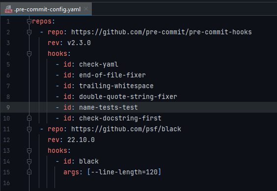
</p>
The picture is actually running for this repo. So, the file checks 7 points (6 ids under the hooks and black)
Once, you change code on this repo and commit the changes through <br>

- git commit -m 'First Commit' on terminal <br>
- Click the "Commit" panel (the left side on Pycharm) <br>

Either way, it runs automatically like the below figure.
<p align="center">
  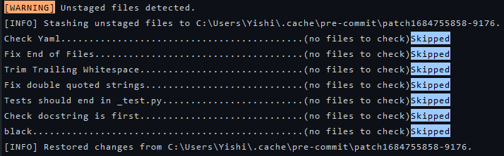
</p>

More information about <br>
pre-commit: https://pre-commit.com/ <br>
black: https://github.com/psf/black <br>

*additional material for code convention: <br>
Docstring: https://peps.python.org/pep-0257/ <br>
Type Hints: https://peps.python.org/pep-0484/ <br>
Unit Test: https://docs.python.org/3/library/unittest.html and start with test_ <br>


# Step 1
## Jenkins
Before downloading, Jenkins should check your PC system. <br>
If you don't have JAVA, you need to download JAVA and Git Bah. <br>
Then you check [System properties -> Environment Variables -> path], System variables has JAVA-HOME and right Path condition. <br>

### How to run Jenkins at localhost
- Download Jenkins <br>
1. Run the below code from your terminal (Pycharm) where Jenkins is located. User\Desktop(Jenkins folder location) <br>

```
java -jar jenkins.war
```
2. Open browser, Type below port number for Jenkins <br>

```
localhost:8080
```
When using Jenkins, do steps 1 and 2 every time. <br>

### How to ues Jenkins
When you open the dashboard, click New Item <br>

<p  align="center">
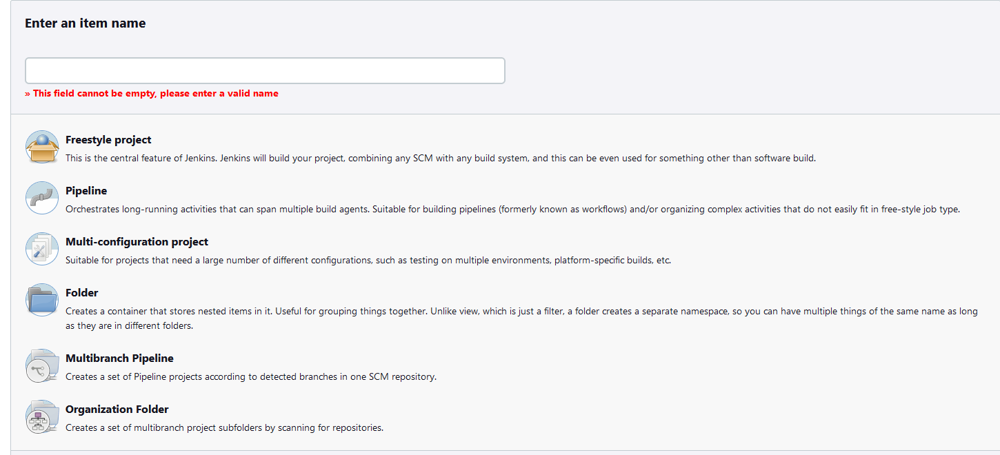
</p>

Look at the picture above <br>

- An item name = your project name
- Click Pipeline

Next step is What do you want to build. <br>

Please follow the picture below
<p  align="center">
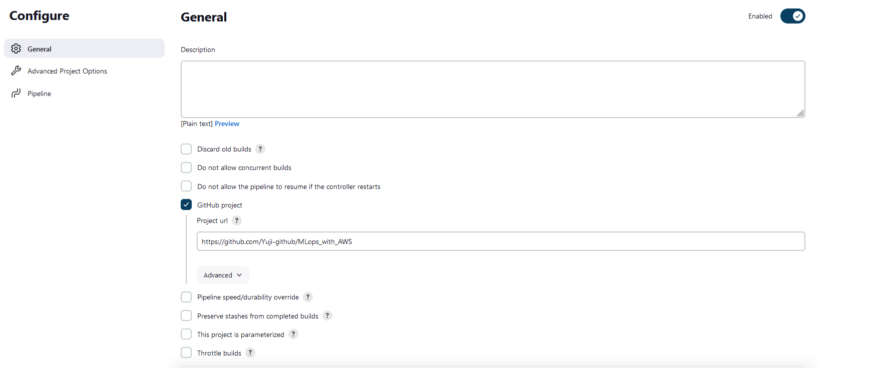
</p>

What do you want to run
- Set * * * * * (every minute) run

<p  align="center">
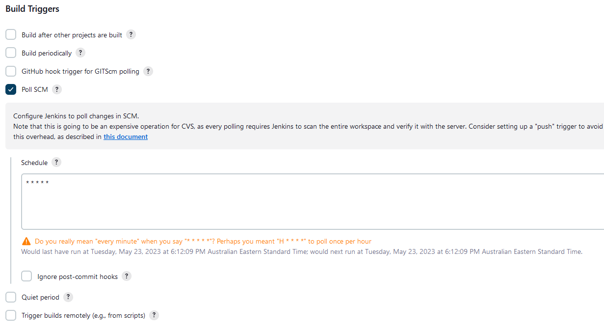
</p>

"Make Pipeline script and explanation of the syntax" <br>
- Click try sample "Pipeline"
- stage is title
- echo is comment

<p  align="center">
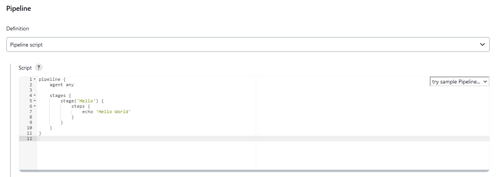
</p>

Click "Build Now" you got the picture below <br>

<p  align="center">
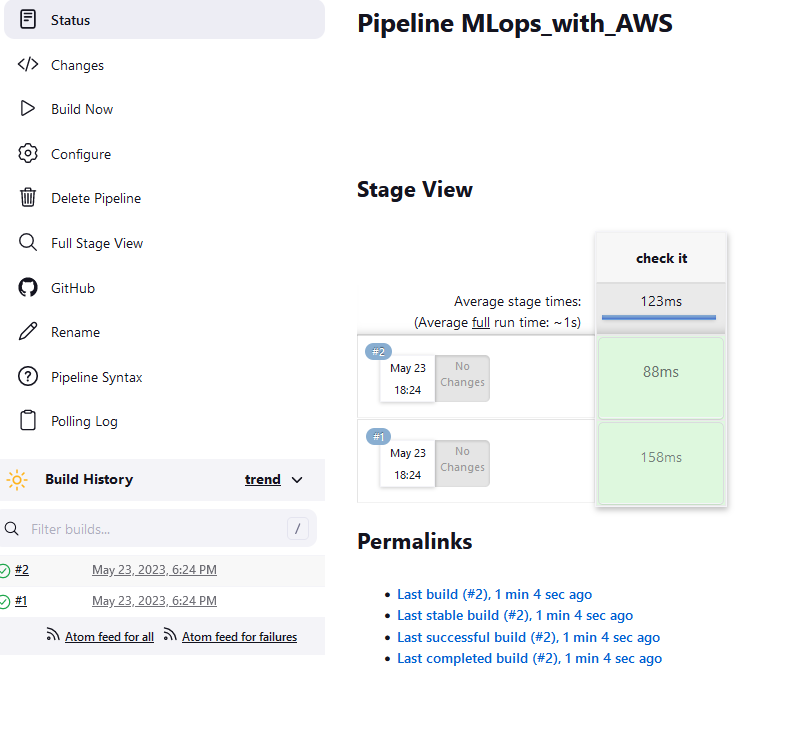
</p>

If the build is red, it's a failure. <br>
You should check the "#number" -> "console output".
Then fix your code update and run it again.<br>

Next step, click the "Pipeline Syntax" <br>
- Checkout: Check out from version control
- SCM -> Git
- Repositories -> Git clone URL
- Credentials -> private access ID & password
- Save it, get script
- bat -> for windows command (This time, build docker)


<p  align="center">
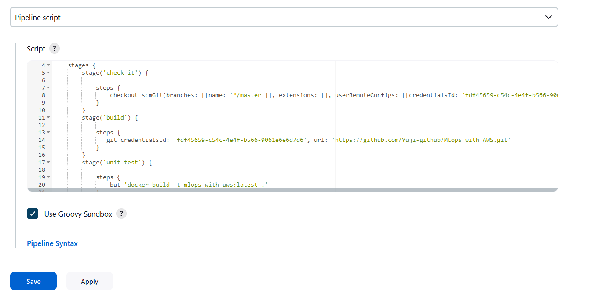
</p>

This time, created three builds.
* First is "check it" for connect Git success.
* Second is "build" for create Git clone.
* Third is "unit test" for run unit test command.


<p  align="center">
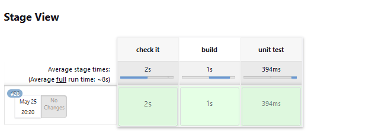
</p>

More information about <br>
CI/CD :https://www.simplilearn.com/tutorials/devops-tutorial/continuous-delivery-and-continuous-deployment

# Step 2
## Docker
Docker is a tool for running your applications inside containers and similar in concept to virtual machines (can be run on any OS).<br>
Containers are great for continuous integration and continuous delivery (CI/CD) workflows. <br>
- Download and install Docker <br>

You should create Dockerfile on your Pycharm. <br>
Docker file name MUST be 'Dockerfile'. <br>

- Dockerfile works top to bottom <br>
- Dockerfile reserved word are the picture below <br>

<p  align="center">
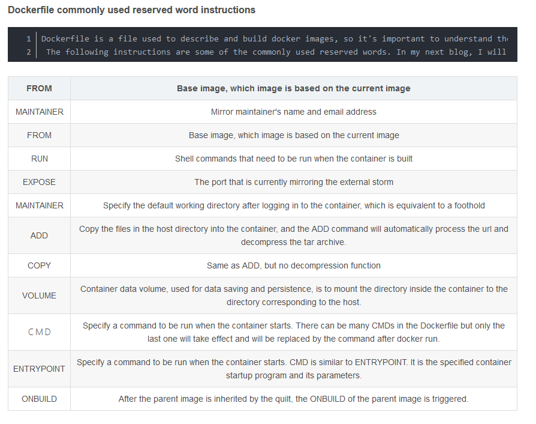
</p>

Created Dockerfile is the picture below <br>

<p  align="center">
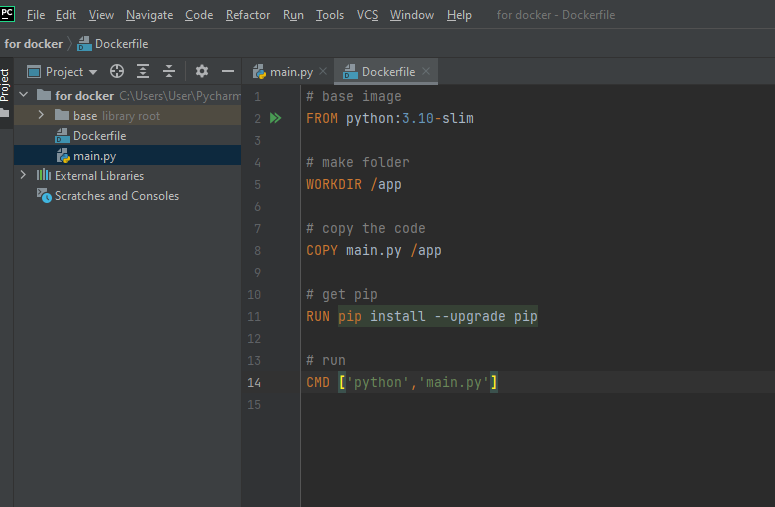
</p>

### How to run docker
- Name and optionally a tag in the name:tag format (latest = NEW) <br>

```
docker build -t test:latest .
```

```
docker images
```

An image is a read-only template with instructions for creating a Docker container. <br>
<p  align="center">
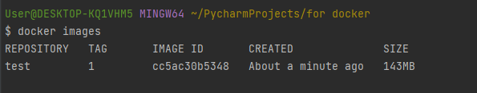
</p>

When you push your code to the master branch on GitHub, GitHub will call Jenkins, and Jenkins runs Docker for unit testing through the above settings. <br>
<p  align="center">
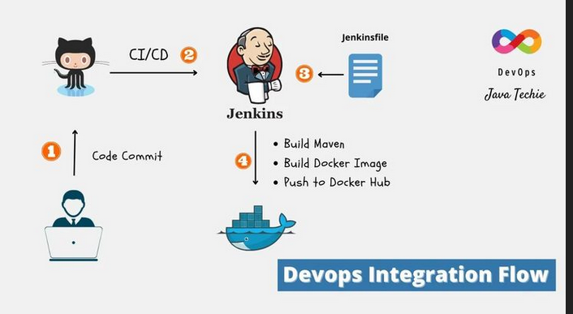
</p>


More information about <br>
Docker: https://docs.docker.com/get-started/overview/
