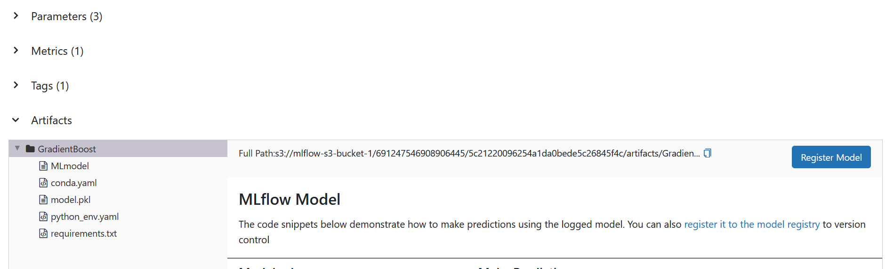

# Step 0
Run the virtual environment like below code

```
source venv/Scripts/activate
```

# Step 1
## Saving Machine Learning Experiments on AWS S3 (EC2)
Before this, you must follow the AWS step guide in AWS Guide Folder in the repo.
You must know your S3 bucket name to store the experiments before creating a bash file (YOUR-S3-NAME)

1. Open EC2 Server
2. [Important]: Create a bash file ```echo "killall gunicorn & mlflow server -h 0.0.0.0 -–default-artifact-root s3://YOUR-S3-NAME" >> run.sh``` on EC2
3. Change TRACKING_SERVER_HOST values in the settings.py to your current public IPv4 (See the AWS Guide Step 10)
4. Change the IPv4 values in the access_ec2_and_run.sh "ssh ec2-user@your current public IPv4" *This runs the run.sh on the EC2.
5. Run the code from the root ```python src/start_training.py```
6. Check the experiment with your browser URL: "your current public IPv4:5000"

# Step 2
## Registration and Deployment on AWS Sagemaker
Once you have enough models on your S3 bucket, time to registry and deploy your model on Sagemaker (ECR->Sagemaker)

[Important]
- Run the virtual environment
- Open Docker Desktop before you run
- Get the S3 bucket folder path "Full Path" from MLflow (URL: "your current public IPv4:5000")

<p align="center">
  
</p>

## How to Execute
Assume running from the root folder

Case 1: Registration Only (Default)
```
python src/registration_and_deployment.py --windows True -fs3 S3_Full_Path_FROM_MLFLOW
-f src/download -mne ANY-NAME
```

Case 2: Deployment Only (ECR must have your Image)
```
python src/registration_and_deployment.py --windows True
--registry_image_ec False
--deployment True
-mns ANY-NAME
--create_config True
-arn arn:aws:iam::123456789:role/service-role/AmazonSageMaker-ExecutionRole-123456789
-bn sagemaker-mlflow-with-aws
-iu 1234567899.dkr.ecr.ap-southeast-2.amazonaws.com/ECR_ImageNameYouGave.aka.mne:version
-rn ap-southeast-2
-it ml.c5.large
```

Case 3: Registration and Deployment
```
python src/registration_and_deployment.py --windows True --deployment True
-fs3 S3_Full_Path_FROM_MLFLOW
-f src/download
-mne ANY-NAME
-mns ANY-NAME
--create_config True
-arn arn:aws:iam::123456789:role/service-role/AmazonSageMaker-ExecutionRole-123456789
-bn sagemaker-mlflow-with-aws
-iu 1234567899.dkr.ecr.ap-southeast-2.amazonaws.com/ECR_ImageNameYouGave.aka.mne:version
-rn ap-southeast-2
-it ml.c5.large
```

# Trouble Shootings
- Name Syntax: AWS does not accept "_", change the name.
- Bash Not Found: You need to go to settings -> terminal -> uncheck activate virtual if you use Pycharm and run venv.
- AWS Region Errors: open terminal ```aws configure```, then, update your region (after your secret key).
- mlflow.exceptions.MlflowException [TImeOut]: Due to the python version (3.9.13 works): Check python_env.yaml;
if the version is 3.11.3, it gives the errors "mlflow.utils.virtualenv: Installing python 3.11.3 if it does not exist" on CloudWatch (AWS)
