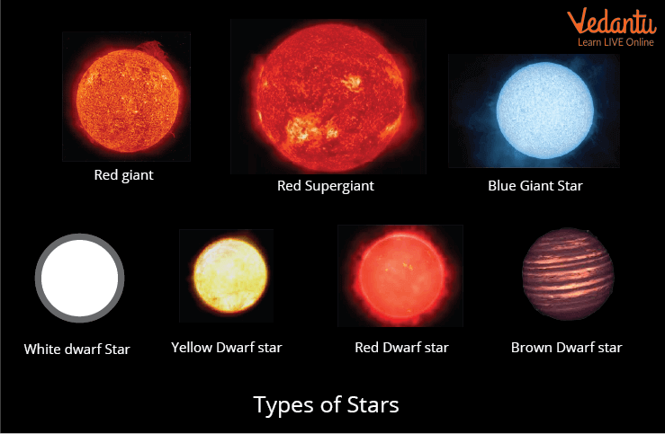

# DataSet Explanation

## Original Source
https://www.kaggle.com/datasets/brsdincer/star-type-classification

### Star Type Classification
Temperature -- K
L -- L/Lo
R -- R/Ro
AM -- Mv
Color -- General Color of Spectrum
Spectral_Class -- O,B,A,F,G,K,M / SMASS - https://en.wikipedia.org/wiki/Asteroid_spectral_types
Type -- Red Dwarf, Brown Dwarf, White Dwarf, Main Sequence , Super Giants, Hyper Giants

  

TARGET:
Type  from 0 to 5

Red Dwarf - 0
Brown Dwarf - 1
White Dwarf - 2
Main Sequence - 3
Super Giants - 4
Hyper Giants - 5

MATH:

Lo = 3.828 x 10^26 Watts
(Avg Luminosity of Sun)

Ro = 6.9551 x 10^8 m
(Avg Radius of Sun)

### Description of features and target variable

The target variable "y" is Type.
This is a categorical variable Type One-Hot from 0 - 5.

The feature Temperature is a numerical variable and shows the Stars Temperature(K).

The feature L is a numerical variable and shows the Relative Luminosity of the Star.

The feature R is a numerical variable and shows the Relative Radius of the Star.

The feature A_M is a numerical variable and shows the Absolute Magnitude of the Star.

The feature Color is a categorical variable and shows the General Obs. Color of the Star.

The feature Spectral_Class is a categorical variable and shows the SMASS Spec. of the Star.
